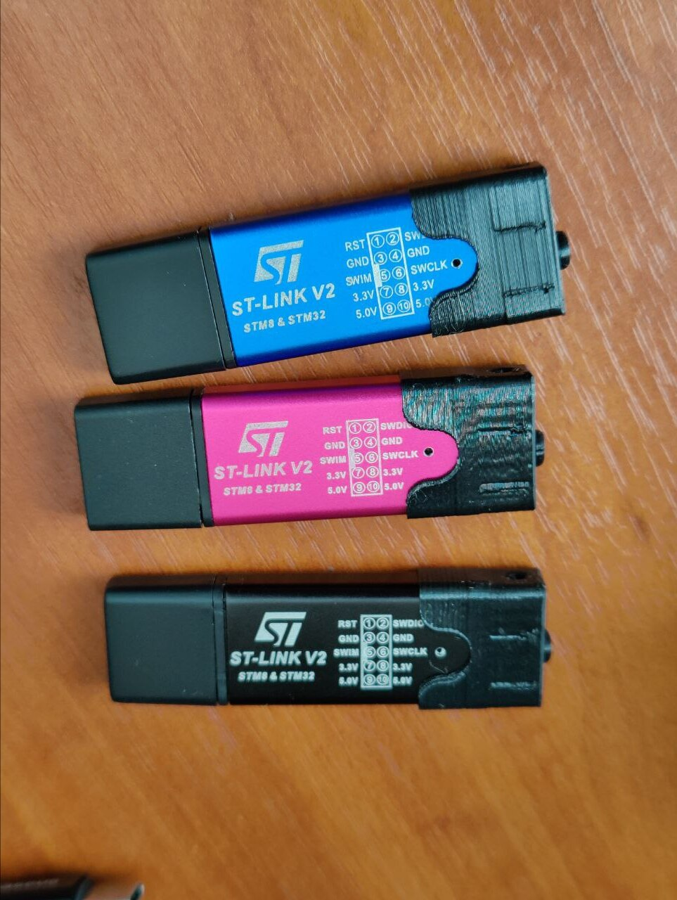

# Making a GNUK token from an STLink V2 dongle the right way

## What is it?

In here, you will find a bunch of (Linux only, Ubuntu-centric) scripts that will fetch and compile a recent release version of [GNUK open source OpenPGP hardware token](https://salsa.debian.org/gnuk-team/gnuk/gnuk) and install them on a clone *(or perhaps, original)* STLink V2 dongle. I made these scripts mostly for myself to ease experimentation and make the process repeatable if I want to do it again in the future, but they might come in handy for you -- if anything, my list of research links is exaustive.

The scripts will also apply a patch that enables the use of `PA5` (marked `SWCLK` on the board) pin for a user interaction button, and another related patch that for whatever reason has been overlooked in pull requests to GNUK which I think won't hurt to add.

Review all shell scripts before you run them and generally be vigilant, because if you aren't, making a hardware token will just be a form of crypto-masturbation.

## Tools and materials

* You need an ST-Link V2 clone dongle. While these are dirt cheap, buying them is a lottery, as you can get any number of variations, often multiple of them in the same batch, so hedge your bets. The script assumes an STLink clone based on a `Geehy APM32`, which is known to work well enough.
* You need a 6x6x5 push button -- at least, the enclosed 3D models in `models` to print an endcap assume you're using one, but you have options. Many people seem to have built one using switches scavenged from mouse buttons, although this will require further mechanical and electrical considerations. Once you can get the firmware running, and get rid of the extraneous stock pin header, you can bend the pins just right and solder the button between +3.3v and SWCLK pads. (and *not* GND and SWCLK as some of the sources say)
* You need access to a 3D printer or at the very least some [Sugru or equivalent](https://sugru.com/what-is-sugru). And/or epoxy, because the paranoid consensus is that you should fill such a device with epoxy to make it as painful to disassemble as possible: STM32 processors do not have a key enclave and are only tamper-resistant up to a point.
* You need [FreeCAD](https://www.freecad.org/) to tinker with the models and/or print them.
* You need a piece of hardware to flash the dongles with [OpenOCD](https://openocd.org/). These scripts assume the use of a [DAP Link programmer](https://daplink.io/) *(in my case an app on the Flipper Zero, because I had that handy).*  When using anything else, you need to replace `interface/cmsis-dap.cfg` with the appropriate cfg file. When using the other STLink -- many people do, considering these dongles are cheap enough to buy a bunch -- use `interface/stlink.cfg`.

## Usage

Consult the references below on how to connect your programming device to the target board and what else you might need to do. In my case, the quickest way was to solder two wires to the pads on the board and plug the power and ground into the pin header.

1. `01-install-prerequisites`
2. `02-fetch-and-build`
3. `03-upload-stlink`

Poof, you're done -- you can get rid of the pin header and try to solder the button on. You will need to cut off two of the pins *(unless you found a comparatively rare 6x6x5 button with only two pins down the middle)* and bend the remaining ones just right if you want it to fit my 3D models.

To get the button to actually function, you need a sufficiently recent version of GPG -- I've been using the [AppImage build obtained from the official source](https://www.gnupg.org/download/) which you can invoke with `./gnupg-desktop-2.4.3.0-x86_64.AppImage -c gpg --card-edit` to get at the GPG console. Then you will be able to issue `uif <n> on` command to make the dongle require a confirmation button press. The dongle will require this button press regardless of what invokes the corresponding function, so you can keep using it with the system version of GPG after that.

If you wish to update the firmware on a completed token, the `04-reupload-stlink` script will invoke the mechanism GNUK has for updating firmware over USB.

Good luck!

## References

* <https://techie-s.work/posts/2021/04/homemade-gnuk/> (where the push button patch originates)
* <https://techie-s.work/posts/2021/05/homemade-gnuk-with-stdongle/>
* <https://blog.darkthread.net/blog/low-cost-diy-usb-security-key/>
* <https://blog.darkthread.net/blog/flash-gnuk-notes/>
* <https://blog.darkthread.net/blog/gpg-keytocard/>
* <https://www.cnblogs.com/tibrella/p/17816505.html>
* <https://kgame.tw/gnupg/stm32-gnuk/>
* <https://blog.danman.eu/2-usb-crypto-token-for-use-with-gpg-and-ssh/>
* <https://www.hobbiton.be/blog/repurpose-stlink/>
* <https://github.com/capt8bit/GnukToken/blob/master/README.md>
* <https://www.drewgreen.net/converting-a-cheap-2-st-link-v2-clone-into-a-hardware-gpg-key/>
* <https://nx3d.org/gnuk-st-link-v2/>
* <https://habr.com/ru/articles/487748/>
* <https://habr.com/ru/articles/496946/>
* <https://habr.com/ru/articles/507010/>
* <https://www.thingiverse.com/thing:3499355>
* <https://blog.josefsson.org/2022/12/24/openpgp-key-on-fst-01sz/>

See also `docs/gnuk-mailing-list-for-reference.txt` which is the archive of the Gnuk mailing list assembled into one text file for easier searching, and contains other relevant wisdom.

